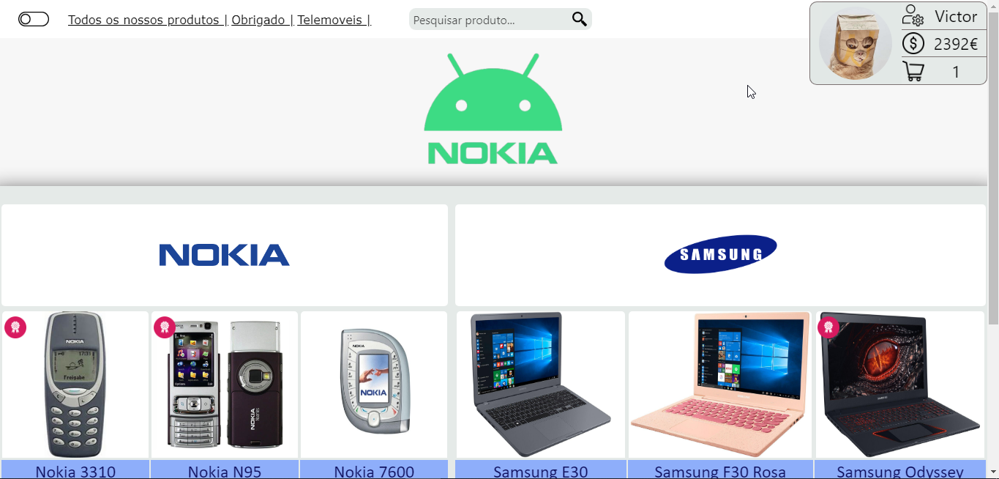
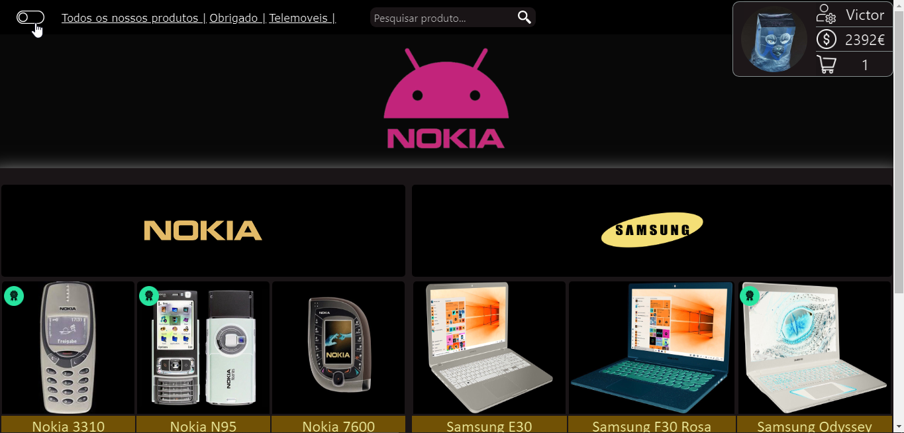

# Meu primeiro "projeto" de HTML

Simplesmente é um repositório com o meu primeiro projeto em HTML — não sou responsável por infartos de programadores.

Este repositório fica como um pequeno arquivo histórico do projeto original, sem tentar esconder as escolhas duvidosas da altura 😭

🔗 **Demo:** https://primeiro-html-zeta.vercel.app

## O que há aqui

- `Index.html` — página principal do projeto.
- `Login.html` e `Registro.html` — páginas de autenticação/registro da interface.
- `agradecimento.html` — página adicional do fluxo original.
- `CSS/`, `Scripts/`, `Images/`, `Audios/` e `Videos/` — assets e recursos usados pelo projeto.

👇 Abaixo, uma print desse projeto incrível.

😯 E o site ainda tinha modo escuro!!!

